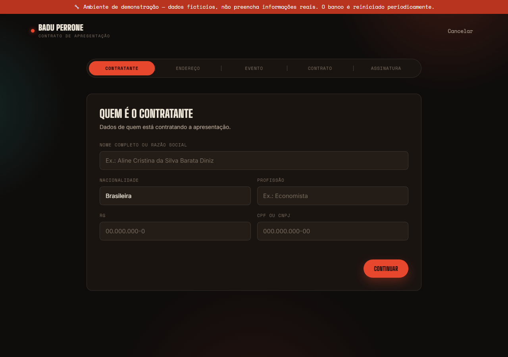
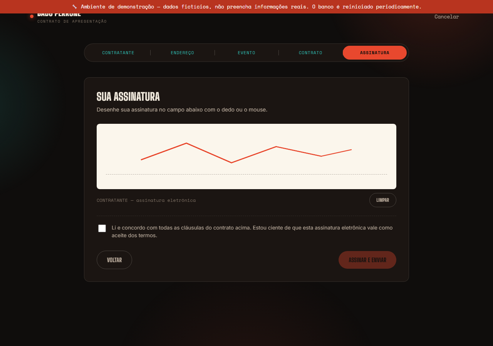
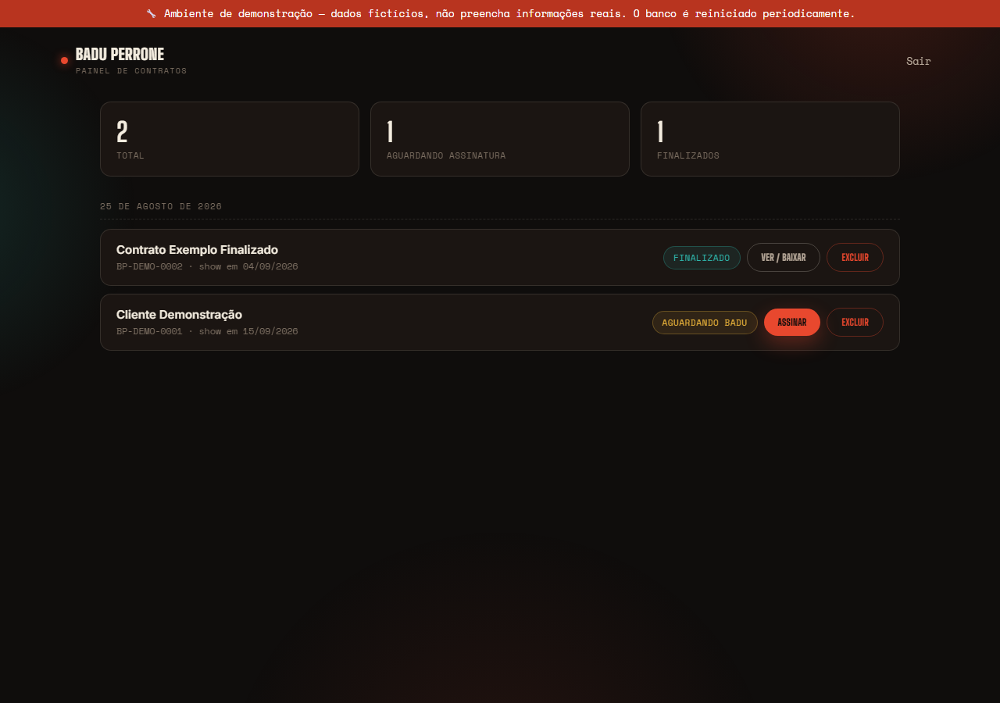
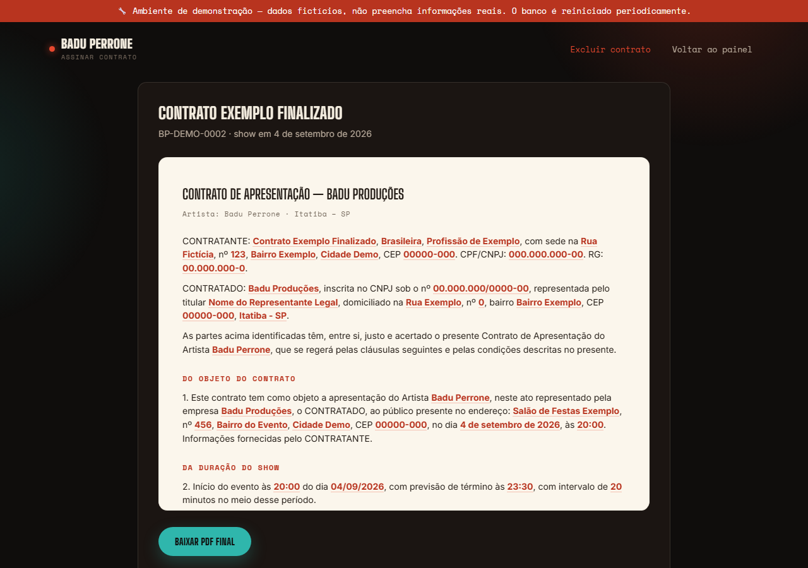
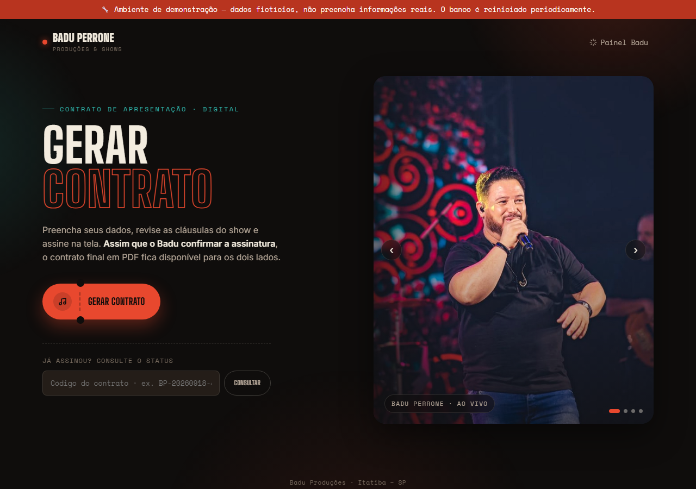

# Badu Perrone — Gerador de Contratos

Geração de contratos de apresentação pro artista Badu Perrone. Cliente preenche o formulário, revisa e assina na tela; o Badu confirma duração/pagamento e assina também; PDF final sai pros dois lados.

## Sobre o projeto

Sistema feito pra um cliente real (Badu Perrone Produções, Itatiba-SP), publicado aqui como amostra de portfólio com autorização dele. Dados reais de clientes do Badu (nome, CPF, RG, contratos assinados) não aparecem neste repositório nem na demo.

## Demo

🔗 [perronibd.onrender.com](https://perronibd.onrender.com/) — dados fictícios (`DEPLOY.md`). Plano free: primeiro acesso pode levar ~30-50s.

Login do painel: `admin@demo.com` / `demo12345` (credenciais públicas de propósito, é ambiente de teste). O banco roda em memória e reseta periodicamente, com dois contratos fictícios pré-carregados.

### Capturas de tela

| Formulário do cliente | Assinatura eletrônica |
|---|---|
|  |  |

| Painel do Badu | Contrato finalizado |
|---|---|
|  |  |

<details>
<summary>Tela inicial</summary>


</details>

## Segurança

- CPF/CNPJ e RG criptografados em repouso (AES-256-GCM, `backend/src/crypto.js`)
- Sessão via cookie `httpOnly`, senha com `bcrypt` — sem localStorage/JWT no front
- Consulta pública nunca devolve CPF/RG; o PDF completo só sai pro Badu autenticado ou pra quem já tem o código de um contrato finalizado
- Dados do contratado (CNPJ, endereço, PIX, conta) vêm de variável de ambiente, não do código (`backend/src/business.js`)
- Modo demo isolado: só dados fictícios, banco efêmero, aviso fixo na tela

## Estrutura

```
badu-contratos/
├── index.html          # telas (landing, formulário, painel do Badu)
├── css/styles.css
├── js/app.js            # formulário, assinatura, chamadas à API, painel admin
├── assets/badu-*.jpg    # fotos do carrossel (material de divulgação do artista)
├── docs/screenshots/
├── backend/             # API + banco (ver backend/README.md)
├── BACKEND_SPEC.md       # spec original do backend
├── DEPLOY.md
└── LICENSE
```

## Rodar localmente

```bash
cd backend
npm install
cp .env.example .env        # preencha ENCRYPTION_KEY e SESSION_SECRET
npm run create-admin -- badu@exemplo.com "uma-senha-bem-forte"
npm start
```

Abra `http://localhost:3000`. Detalhes de cada rota em [`backend/README.md`](backend/README.md).

Pra rodar igual à demo (dados fictícios, sem precisar de `create-admin`):

```bash
DEMO_MODE=true npm start
```

## Funcionalidades

- Formulário em 3 passos (contratante, endereço, evento) + revisão + assinatura na tela
- Texto do contrato com cláusulas fixas e campos variáveis destacados
- Código de acompanhamento (`BP-20260918-4F2K`) e consulta de status
- Login do Badu (e-mail/senha, cookie httpOnly), painel com:
  - Lista de contratos por data, contador de pendentes/finalizados
  - Edição de duração, intervalo e valores (entrada/restante)
  - Prévia em tempo real, assinatura do Badu, exclusão com confirmação
- PDF final gerado no servidor (`pdfkit`), com as duas assinaturas
- CPF/CNPJ/RG criptografados em repouso
- Modo demo pronto pra deploy público

## Próximo passo

SQLite hoje; migrar pra Postgres depois só troca `backend/src/db.js` — resto (rotas, mapper, criptografia) não muda. Detalhes em `backend/README.md`.

## Licença

MIT, só pro código (ver [`LICENSE`](LICENSE)). Não cobre o nome/marca "Badu Perrone" / "Badu Produções", as fotos em `assets/` nem o texto do contrato — isso é do cliente, aparece aqui só como amostra de portfólio.
